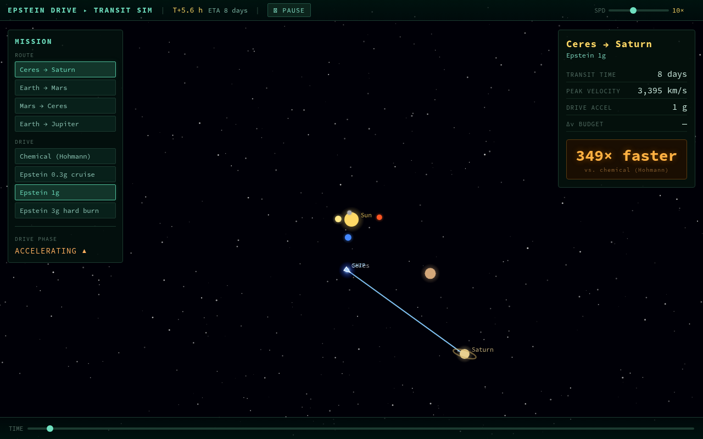

# Epstein Drive — Orbital Transit Simulator

A Lean 4 orbital-mechanics simulator with a browser visualizer, built for a
SciFi Night talk on *The Expanse* to answer one question on stage:

> **How much does the Epstein Drive's constant "flip-and-burn" thrust change
> interplanetary travel, compared to the chemical rockets we actually fly today?**

Pick a route and a drive, watch the ship fly, and read the numbers. The drama is
the contrast: a trip that takes a chemical rocket *years* takes an Epstein-drive
ship *days*.

- **Earth → Mars:** 259 days by chemical rocket → **~4 days at 1 g** (≈64× faster)
- **Ceres → Saturn** (the *Canterbury*'s ice run, S1E1 "Dulcinea"): **~7.7 years → ~8 days** (≈349× faster)



## Why this project exists (intent)

- **Show the physics, not just the fiction.** The real orbital mechanics runs in
  Lean under the hood; the visualizer is pure display. Orbital periods *emerge*
  from an N-body integrator rather than being hard-coded.
- **Make the Epstein Drive the star.** The headline is the flip-and-burn
  (brachistochrone) trajectory and how it collapses transit times — framed
  directly against today's Hohmann transfers as the baseline.
- **Be presentable and configurable.** Speeds and routes live in a config file so
  the presenter can pull rough numbers and add/change trips on the fly. Routes
  default to the trips from the first two episodes (the Belt ice run) plus the
  canonical Earth↔Mars reference.
- **Approximate deliberately, but not too much.** Fast closed-form models for
  rendering, with the higher-fidelity N-body core kept as a validated reference.
  Every approximation is documented and test-justified.

See **[docs/PHYSICS.md](docs/PHYSICS.md)** for the equations, the approximations,
and the full numbers table — the presenter cheat sheet.

## Quick start

```bash
export PATH="$HOME/.elan/bin:$PATH"

lake build                 # build the Lean simulator
lake exe tests             # run the 38-assertion physics test suite
lake exe lean-testing      # compute missions → visualizer/trajectory.json (+ prints the catalog)

# view it
npx http-server visualizer -p 8080 -c-1   # then open http://localhost:8080
```

## How the simulation works

```
config/missions.json ──▶ Lean simulator ──▶ visualizer/trajectory.json ──▶ Canvas UI
   (drives + routes)      (LeanTesting/)       (self-contained missions)     (visualizer/)
```

The Lean program reads the config and, for every **route × drive**, computes a
self-contained *mission* — the numbers plus a time-uniform sequence of frames
(every planet's position + the ship's position) — using one of two drive models:

- **Epstein drive (flip-and-burn / brachistochrone).** Constant proper
  acceleration `a` the whole way: accelerate to the midpoint, flip 180°,
  decelerate in. Transit time `t = 2·√(d/a)`, peak velocity `v = √(a·d)`. The
  Sun's gravity is ~500× weaker than even a 0.3 g burn, so the path is treated as
  a straight line to the target's intercept point (we "lead" the moving planet
  with a fixed-point solver). → `Brachistochrone.lean`
- **Chemical rocket (Hohmann transfer).** Two impulsive burns and a long coast
  along half an ellipse. Transit time `t = π·√(a_t³/μ)`, Δv from vis-viva; the
  arc is rendered by solving Kepler's equation so the ship slows near aphelion.
  → `Hohmann.lean`, `Transfer.lean`

Each Epstein mission also reports its **speed-up vs. the same route's chemical
Hohmann time** — the "N× faster" badge. Planet positions use a circular-orbit
model for speed; the N-body RK4 core remains as the validated reference (Earth's
year emerges at ~364 days). The visualizer never computes trajectories — JSON is
the single interface.

## Configuration

Edit **`config/missions.json`** and re-run `lake exe lean-testing`. Add a route
between any two of the 10 bodies (Sun, Mercury … Neptune, Ceres), or change a
drive's acceleration (`accelG` in Earth g's; `0` means chemical/Hohmann):

```jsonc
{ "drives": [ { "id": "ep1", "label": "Epstein 1g", "accelG": 1.0 }, ... ],
  "routes": [ { "from": "Ceres", "to": "Saturn" }, ... ] }
```

Default catalog (printed every run):

| Route | Chemical (Hohmann) | Epstein 1 g | At 3 g |
|---|---|---|---|
| Earth → Mars | 259 days (Δv 5.6 km/s) | ~4 days, ~64× | ~2 days, ~110× |
| Mars → Ceres | ~1.6 years | ~5 days, ~108× | ~3 days |
| Earth → Jupiter | ~2.7 years | ~6 days, ~158× | ~3 days |
| Ceres → Saturn | ~7.7 years | ~8 days, ~349× | ~4 days |

## Tests

Designed first, then implemented against. Both suites run in CI.

```bash
lake exe tests             # 38 Lean assertions: brachistochrone, intercept solver,
                           #   Hohmann 259d/574d/7.7yr, Δv, Kepler, JSON parser,
                           #   missions/speed-up, export round-trip, RK4 energy conservation
npm install                # @playwright/test
npx playwright test        # 11 tests: picker populated, numbers-match-JSON,
                           #   chemical-vs-Epstein, ship animation, phase indicator, controls
```

## Code map

| Layer | Files |
|---|---|
| Physics core (N-body RK4, vectors, gravity) | `LeanTesting/{Vec2,Body,Forces,RK4}.lean` |
| Orbit + drive models | `LeanTesting/{Orbit,Brachistochrone,Hohmann,Transfer}.lean` |
| Config / JSON parser | `LeanTesting/{Json,Config}.lean`, `config/missions.json` |
| Mission assembly + export | `LeanTesting/{Mission,Export}.lean`, `Main.lean` |
| Tests | `Tests.lean` (Lean), `tests/missions.spec.js` (Playwright) |
| Visualizer | `visualizer/{index.html,sim.js,style.css}` |
| Presenter notes | `docs/PHYSICS.md` |
